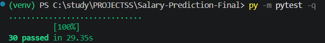
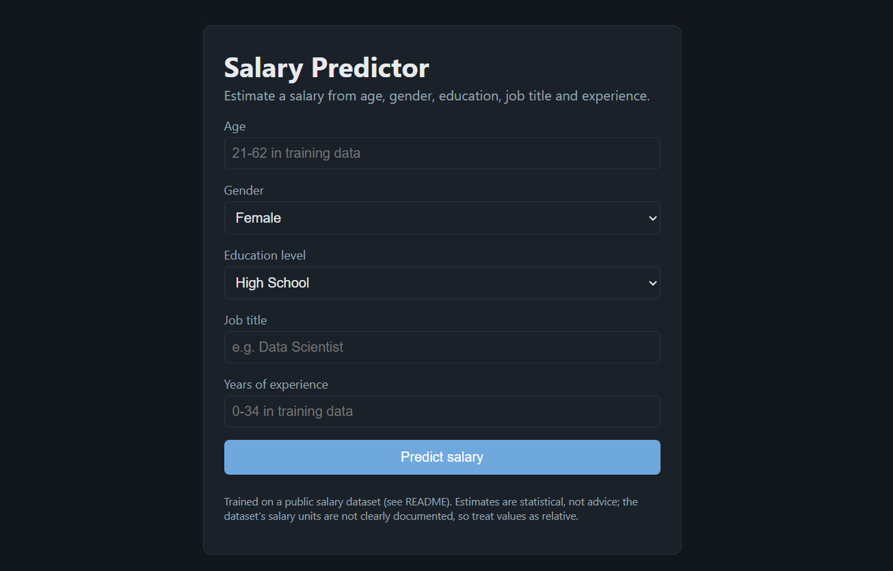
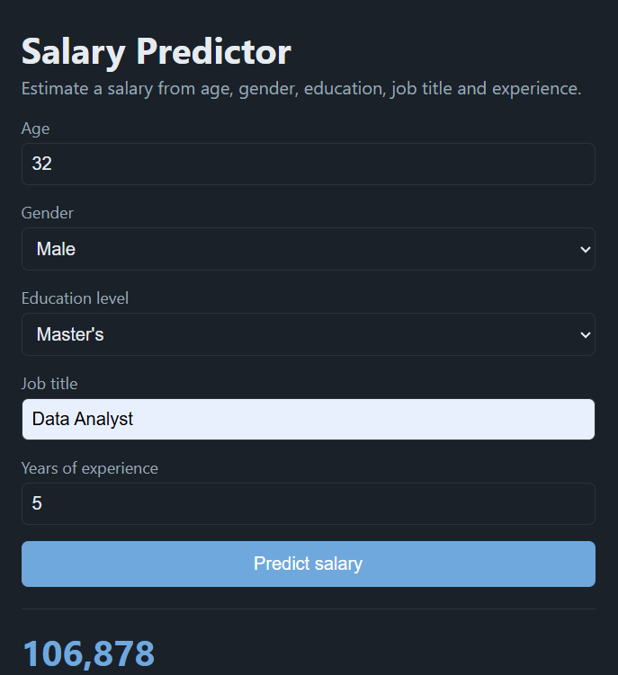

# 💰 Salary Prediction System

<p align="center">

  
  
  
  
  

</p>

<p align="center">
  <b>An end-to-end machine learning application for predicting employee salary from professional and demographic attributes.</b>
</p>

---

## 📌 Overview

The **Salary Prediction System** is a machine learning application that estimates an employee's salary using:

- Age
- Gender
- Education Level
- Job Title
- Years of Experience

The project follows a complete ML pipeline:

```text
Raw Dataset
     ↓
Data Cleaning
     ↓
Feature Engineering
     ↓
Train / Test Split
     ↓
Preprocessing
     ↓
Model Comparison
     ↓
Hyperparameter Tuning
     ↓
Best Model Selection
     ↓
Evaluation
     ↓
Saved ML Pipeline
     ↓
Flask Web Application
     ↓
Salary Prediction
```

The system compares multiple regression algorithms and automatically selects the best-performing model using cross-validation.

---

# 🚀 Key Features

### 🧹 Data Cleaning
- Normalizes column names and categorical values
- Removes missing target values
- Removes implausible salary values
- Removes exact duplicate records
- Handles missing feature values through preprocessing

### 🧠 Feature Engineering

Additional features are derived from the original dataset, including:

- `Experience_Squared`
- `Career_Stage`
- `Title_Level`

These features help the models capture nonlinear relationships and seniority information.

### ⚙️ Automated Preprocessing

The project uses `ColumnTransformer` and separate preprocessing pipelines for numerical and categorical features.

**Numerical features:**

```text
Median Imputation
      ↓
Standard Scaling
```

**Categorical features:**

```text
Categorical Imputation
      ↓
Encoding
      ↓
Model
```

Job titles are handled as high-cardinality categorical features, with infrequent categories grouped to reduce overfitting.

### 🤖 Multiple ML Models

The project compares:

- Linear Regression
- Random Forest
- Gradient Boosting

Hyperparameters are optimized using:

```text
GridSearchCV
```

The model with the best cross-validation RMSE is selected automatically.

### 💾 Model Persistence

The complete preprocessing + model pipeline is saved using **Joblib**.

This ensures that the same transformations used during training are also used during prediction.

### 🌐 Flask Web Application

A Flask application provides:

- Interactive web interface
- Salary prediction
- Input validation
- Training-range warnings
- Prediction API
- Health-check endpoint

---

# 🏗️ Project Architecture

```text
                         ┌─────────────────────┐
                         │   Salary Dataset    │
                         │   Salary_Data.csv   │
                         └──────────┬──────────┘
                                    │
                                    ▼
                         ┌─────────────────────┐
                         │    Data Loader      │
                         │   data_loader.py    │
                         └──────────┬──────────┘
                                    │
                                    ▼
                         ┌─────────────────────┐
                         │ Feature Engineering │
                         │ feature_engineering │
                         └──────────┬──────────┘
                                    │
                                    ▼
                         ┌─────────────────────┐
                         │ Train / Test Split  │
                         └──────────┬──────────┘
                                    │
                                    ▼
                 ┌────────────────────────────────────┐
                 │       Preprocessing Pipeline       │
                 │                                    │
                 │ Numeric → Imputation → Scaling    │
                 │ Categorical → Encoding             │
                 └────────────────┬───────────────────┘
                                  │
                                  ▼
              ┌──────────────────────────────────────────┐
              │             Model Comparison             │
              │                                          │
              │ Linear Regression                        │
              │ Random Forest                            │
              │ Gradient Boosting                        │
              └────────────────────┬─────────────────────┘
                                   │
                                   ▼
                         ┌─────────────────────┐
                         │    GridSearchCV     │
                         │ Hyperparameter Tune │
                         └──────────┬──────────┘
                                    │
                                    ▼
                         ┌─────────────────────┐
                         │  Best Model        │
                         │ Gradient Boosting  │
                         └──────────┬──────────┘
                                    │
                                    ▼
                         ┌─────────────────────┐
                         │ Saved ML Pipeline   │
                         │ salary_pipeline     │
                         │      .joblib        │
                         └──────────┬──────────┘
                                    │
                                    ▼
                         ┌─────────────────────┐
                         │   Flask Application │
                         │      app.py         │
                         └──────────┬──────────┘
                                    │
                                    ▼
                         ┌─────────────────────┐
                         │  Salary Prediction  │
                         └─────────────────────┘
```

---

# 📂 Project Structure

```text
Salary-Prediction-Final/
│
├── app.py
├── requirements.txt
├── README.md
│
├── data/
│   └── raw/
│       └── Salary_Data.csv
│
├── models/
│   └── salary_pipeline.joblib
│
├── reports/
│   ├── metrics.json
│   └── ...
│
├── src/
│   ├── config.py
│   ├── data_loader.py
│   ├── feature_engineering.py
│   ├── preprocessing.py
│   ├── models.py
│   ├── model_loader.py
│   ├── predict.py
│   ├── train.py
│   ├── eda.py
│   └── reporting.py
│
├── tests/
│   └── test_salary.py
│
└── screenshots/
    ├── salary-prediction-result.png
    ├── salary-predictor-interface.png
    └── tests-passed.png
```

---

# 📊 Model Performance

The final training run selected **Gradient Boosting** as the best-performing model.

| Metric | Result |
|---|---:|
| Selected Model | Gradient Boosting |
| Test Samples | 357 |
| RMSE | 14,689 |
| MAE | 9,294 |
| R² | 0.920 |

### What these metrics mean

**MAE — 9,294**

On average, the prediction differs from the actual salary by approximately 9,294 salary units.

**RMSE — 14,689**

RMSE gives more weight to larger prediction errors, making it useful for evaluating whether the model occasionally makes large mistakes.

**R² — 0.920**

The model explains approximately 92% of the variance in the held-out test data.

> Note: The dataset's salary units are not clearly documented, so the predictions should be interpreted as statistical estimates rather than financial advice.

---

# 🧪 Testing

The project includes automated tests covering:

- Data loading
- Data cleaning
- Feature engineering
- Preprocessing
- Model training
- Model selection
- Prediction validation
- Model persistence
- Reproducibility
- Flask endpoints

The final local test run:

```text
30 passed in 29.35s
```

### Test Result



---

# 🖥️ Web Application

The project provides a Flask-based web interface where users can enter:

- Age
- Gender
- Education Level
- Job Title
- Years of Experience

and receive a predicted salary.

### Application Interface



---

# 💰 Example Prediction

Example input:

```text
Age: 32
Gender: Male
Education: Master's
Job Title: Data Analyst
Years of Experience: 5
```

Example prediction:

```text
Predicted Salary: 106,878
```

### Prediction Result



> The values shown in the screenshots are sample inputs used to demonstrate the application and do not represent a real employee.

---

# 🔌 REST API

The Flask application exposes REST endpoints.

### Health Check

```http
GET /api/health
```

Example response:

```json
{
  "status": "ok"
}
```

### Prediction

```http
POST /api/predict
```

Example request:

```json
{
  "Age": 32,
  "Gender": "Male",
  "Education_Level": "Master's",
  "Job_Title": "Data Analyst",
  "Years_of_Experience": 5
}
```

Example response:

```json
{
  "predicted_salary": 106878,
  "typical_error_mae": 9294,
  "model": "gradient_boosting",
  "warnings": []
}
```

---

# ⚙️ Installation

## 1. Clone the repository

```bash
git clone https://github.com/kethan1906/salary-prediction.git
cd salary-prediction
```

## 2. Create a virtual environment

### Windows

```bash
py -m venv venv
```

Activate it:

```bash
venv\Scripts\activate
```

## 3. Install dependencies

```bash
py -m pip install -r requirements.txt
```

---

# 🏋️ Train the Model

Run:

```bash
py -m src.train
```

This will:

1. Load the dataset
2. Clean the data
3. Engineer features
4. Split the dataset
5. Build preprocessing pipelines
6. Train candidate models
7. Perform hyperparameter tuning
8. Select the best model
9. Evaluate the final model
10. Save the trained pipeline

The trained model is saved as:

```text
models/salary_pipeline.joblib
```

---

# 🌐 Run the Application

Start Flask:

```bash
py app.py
```

Open:

```text
http://127.0.0.1:5000
```

---

# 🧪 Run Tests

Run the complete test suite:

```bash
py -m pytest -q
```

Expected result:

```text
30 passed
```

---

# 🧠 Machine Learning Pipeline

The project uses a single end-to-end pipeline:

```text
Input Data
    ↓
Feature Engineering
    ↓
ColumnTransformer
    ├── Numerical Features
    │       ↓
    │   Median Imputation
    │       ↓
    │   Scaling
    │
    └── Categorical Features
            ↓
        Imputation
            ↓
        Encoding
    ↓
Regression Model
    ↓
Predicted Salary
```

Keeping preprocessing and the model together is important because the exact same transformations are applied during both training and prediction.

---

# 🔍 Model Selection

Three regression algorithms are evaluated:

### Linear Regression

Provides a simple baseline and assumes a relatively linear relationship between features and salary.

### Random Forest

Uses an ensemble of decision trees and can capture nonlinear relationships and feature interactions.

### Gradient Boosting

Builds trees sequentially, where each new tree attempts to improve the errors made by previous trees.

The final system selected **Gradient Boosting** based on the lowest tuned cross-validation RMSE.

---

# 🛡️ Input Validation

The application also performs validation before prediction.

Examples include:

- Invalid age values
- Invalid experience values
- Missing required fields
- Unknown categorical values
- Inputs outside the training range

For example, if an age is outside the training range, the application can still provide an estimate but warns that the result is an extrapolation and may be unreliable.

---

# 📈 Data Quality

The dataset initially contained:

```text
Raw rows:        6,704
Clean rows:      1,783
Training rows:   1,426
Testing rows:      357
```

The cleaning process removed:

- Missing salary records
- Implausible salary values
- Exact duplicate records

Deduplication is performed before the train/test split to reduce the possibility of identical records appearing in both datasets.

---

# 🧰 Technologies Used

| Technology | Purpose |
|---|---|
| Python | Core programming language |
| Pandas | Data manipulation |
| NumPy | Numerical operations |
| Scikit-learn | Machine learning |
| Flask | Web application / REST API |
| Joblib | Model serialization |
| Pytest | Automated testing |
| HTML/CSS | Frontend interface |

---

# 💡 Why This Project?

This project demonstrates an end-to-end machine learning workflow rather than only training a model in a notebook.

It covers:

```text
Data
 ↓
Cleaning
 ↓
Feature Engineering
 ↓
Preprocessing
 ↓
Model Training
 ↓
Hyperparameter Tuning
 ↓
Evaluation
 ↓
Model Persistence
 ↓
REST API
 ↓
Web Application
 ↓
Testing
```

This makes the project suitable for demonstrating practical machine learning and software engineering concepts.

---

# 🎯 Interview Highlights

The most important concepts demonstrated in this project are:

- Supervised learning
- Regression
- Feature engineering
- Train/test splitting
- Cross-validation
- GridSearchCV
- RMSE
- MAE
- R²
- ColumnTransformer
- One-hot encoding
- Ordinal encoding
- Imputation
- Feature scaling
- Random Forest
- Gradient Boosting
- Model persistence
- Joblib
- Flask
- REST APIs
- Input validation
- Automated testing
- ML pipeline design

---

# 👨‍💻 Author

**Kethan**

Software Engineering & Machine Learning Projects

---

<p align="center">
  ⭐ If you found this project useful, consider giving the repository a star!
</p>
